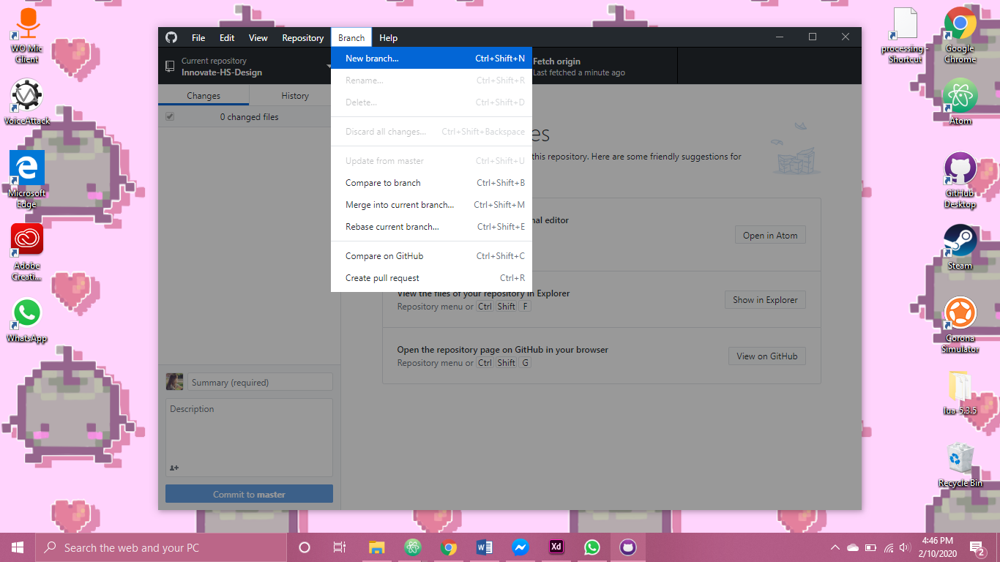

# Innovate-HS-design
Soft goals for Wednesday 26th:

Replace pagination with buttons
ask cassens to compile and check for first page
Json on those three Pages
Json for retrieving data? 
login page after registration?
Admin Page?

Phew, that was exhausting (✖╭╮✖)

| Soft goals for Monday Feb 24th                                   |
| ---------------------------------------------------------------- |
| [X] Organize files                                               |
| [x] Connect pages with JavaScript                                |
| [x] Proofread pages                                              |
| [] Label objects with JS and Json for Data design group          |
| [X] Cry                                                          |
| [] Look into Gameplay idea, QR Code Camera reader implementation |
| [] Admin Website?                                                |

#### Done Feb 19 2020
Hey All! This is the Git Repo for the Design/Front-End-Dev for the Spring 2020 Innovate HS project!
 *✧･ﾟ: *✧･ﾟ:Throws Confetti:･ﾟ✧:･ﾟ✧*

https://clarissaspain.github.io/Innovate-HS-Design/

Here's some material for how to branch and merge Repos since there will be a lot of us on this repo:

*On Github Desktop:*

*Then you can write your name or whatever to start your own branch. Then at the end of the week or before class we can merge what we did to the Master? That way we're not constantly pulling requests when we try to push commits to the repo.*

Here's some more in depth information about branching and merging:
https://git-scm.com/book/en/v2/Git-Branching-Basic-Branching-and-Merging

I recommend using Github Desktop and cloning the Repo for easy access :)
Also if you are having any issues, or need help with Github or Repo branching, feel free to message me or call (I'll do my IT Helpdesk Voice).

#### Page Checklist:
| Pages based on Mockup               | Please place x in [] when completed |
| ----------------------------------- | ----------------------------------- |
| [x] Welcome & Video: Solly & Claire | [x] Speakers: Miya                  |
| [x] Student Info: John               | [x] Food Zoo: Claire                |
| [x] Top 2 Topics: Austin            | [tentatively...] Map: Miya          |
| [x] Top 2 Faculty: Claire           | [x] Post Conference: Claire         |
| [x] Questions: John                  | [x] Feedback (5): Claire            |
| [x] Complete                        |                                     |
| [x] Resources Post: Claire          |                                     |
| [x] Schedule: Miya                  |                                     |

### Good luck!
